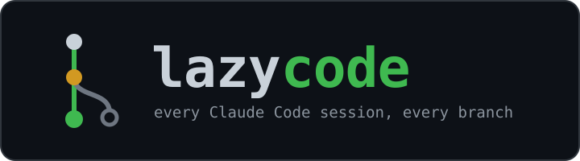
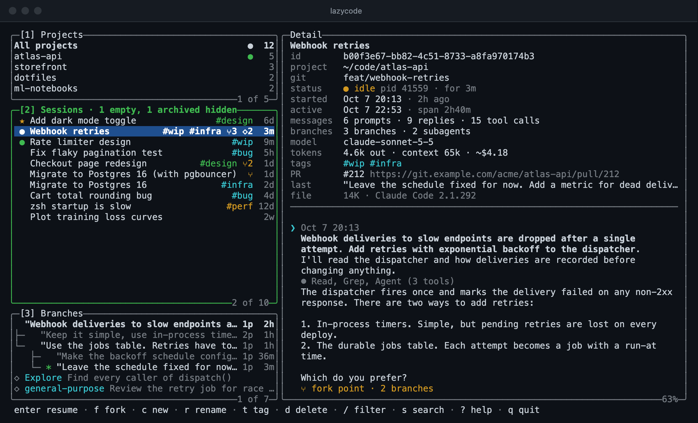
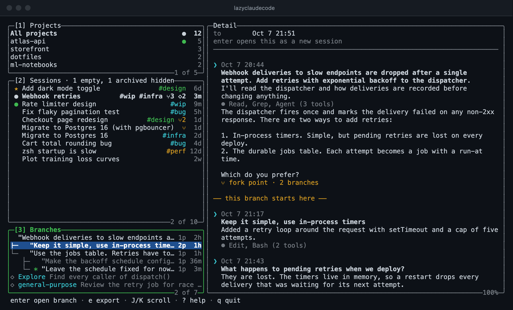
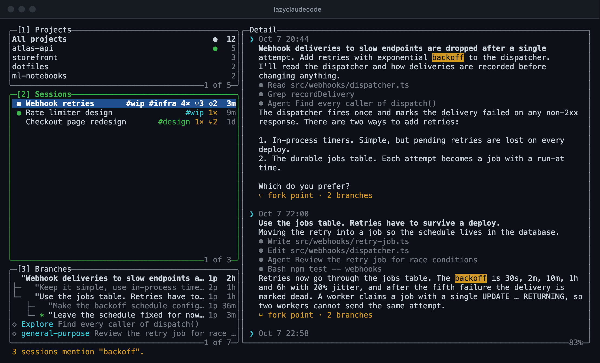
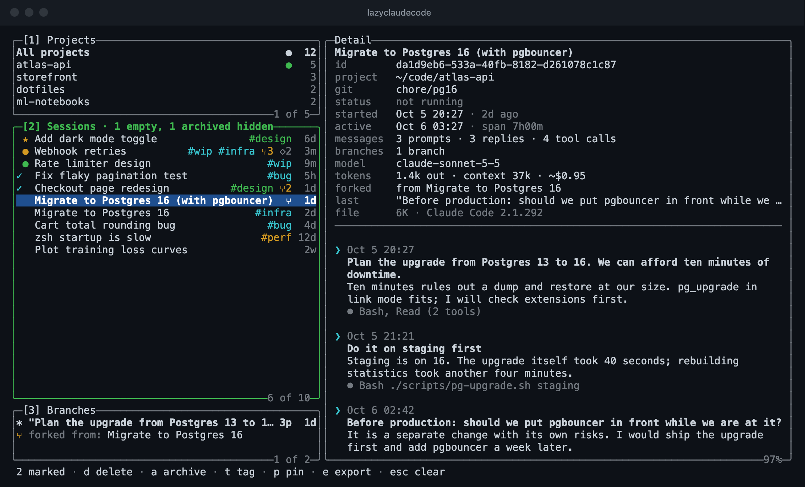
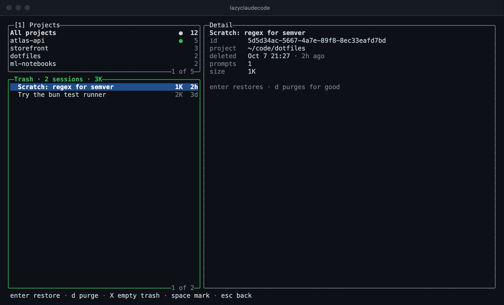

<p align="center">
  
</p>

<p align="center">
  <b>Every Claude Code session you have ever had, and every branch inside it, in one terminal window.</b>
</p>

<p align="center">
  <a href="https://github.com/vashuteotia123/lazyclaudecode/actions/workflows/test.yml"></a>
  
  
  <a href="LICENSE"></a>
</p>

<p align="center">
  <a href="#why-this-exists">Why</a> ·
  <a href="#what-it-can-do">Features</a> ·
  <a href="#install">Install</a> ·
  <a href="#keys">Keys</a> ·
  <a href="#what-it-touches">What it touches</a>
</p>

lazyclaudecode is a terminal browser for Claude Code sessions, in the spirit of
[lazygit](https://github.com/jesseduffield/lazygit). Claude Code remembers everything: every
conversation in every project, including the attempts you rewound away from. It just does not give
you a good way to look at it all. lazyclaudecode does:

- **One list for all projects**, with running sessions marked and worktrees grouped under their
  repository.
- **A branch tree for each session**, so a prompt you rewound an hour ago can be read again and
  reopened as a session of its own.
- **Search across every transcript**, plus tags, pins and archiving to keep the list meaningful.
- **A trash with undo**, so clearing out old sessions is safe.

It is a single command with no dependencies, it makes no network requests, and it never rewrites a
session file.



Every screenshot here is generated from a fictional demo home, not from real sessions.

## Why this exists

Claude Code saves every conversation, and after a few weeks that is hundreds of sessions spread
over a dozen projects. Getting back to the right one is harder than it should be:

- **Rewound work disappears.** When you rewind or edit an earlier prompt, Claude Code keeps the
  abandoned continuation in the session file but never shows it again. The approach you tried and
  dropped an hour ago is still on disk with no way to reach it.
- **Work is spread across projects.** Finding what you did yesterday means remembering which
  repository or worktree it happened in, then looking there.
- **Sessions are hard to tell apart.** A list of first prompts does not say which session is the
  one that matters, which is a dead end, or which is still running in another terminal.
- **You cannot search what was said.** You remember that Claude explained the backoff schedule
  somewhere, but not in which session.
- **Nothing gets cleaned up.** Empty and throwaway sessions pile up, and deleting files by hand
  from `~/.claude/projects` is not something anyone should do casually.

lazygit made git's hidden state visible and navigable from the keyboard. lazyclaudecode tries to do the
same for Claude Code's session store.

## What it can do

### See everything in one place

Three panels on the left and a detail pane on the right:

- **Projects** lists every project you have used Claude Code in, with a session count and a green
  dot when something is running there. Git worktrees are grouped under their main repository.
- **Sessions** lists the sessions of the selected project, or of all of them. Each row shows the
  title, tags, a branch count (`⑂3`), a subagent count (`◇2`) and when it was last active. A
  yellow dot means the session is open and idle in another terminal; a green dot means it is busy.
- **Branches** shows the shape of the selected session: its rewind branches, forks and subagents.
- **Detail** shows the facts (project, git branch, model, tokens, cost, linked pull requests) and
  the transcript, condensed so that a long tool run takes one line. Press `z` for the full text.

Press `enter` to resume the selected session in Claude Code, `f` to fork it, or `c` to start a new
one in the same project. When you leave Claude Code you are back in lazyclaudecode.

### Recover branches you rewound away from



lazyclaudecode reads the whole session file and draws every continuation as a tree, with `*` on the
branch the session is currently on. Select an abandoned branch to read it; the transcript marks
where that branch starts.

Press `enter` on an abandoned branch, or on a fork point, to check it out: lazyclaudecode writes that
branch's history to a new session and resumes it. The original session is never modified.

Three different things are shown in this panel:

- **Rewind branches** are the continuations left behind when you rewind or edit a prompt.
- **Session forks** are made by `claude --resume <id> --fork-session`, which copies a session into
  a new one. A fork and its parent link to each other, and `enter` jumps between them.
- **Subagents** are not branches. They are listed with their own transcripts so you can read what
  each one was asked and what it reported.

### Search inside transcripts



Press `s` and type a phrase. lazyclaudecode searches what you typed and what Claude replied, on every
branch of every session, and narrows the list to the sessions that mention it with a match count
on each. The transcript opens at the first match; `n` and `N` step through the rest.

For a quicker cut, `/` filters the list as you type by title, prompt, git branch, path or `#tag`.

### Organise and clean up



- `r` renames a session. The new name also shows in Claude Code's own `/resume` picker.
- `t` tags it: typing `wip -blocked` adds `wip` and removes `blocked`, and tab completes tags you
  have used before.
- `p` pins it to the top of the list, and `a` archives it out of sight (`H` shows archived and
  empty sessions again).
- `space` marks a session, `v` marks a range and `*` marks everything listed. With sessions
  marked, `d`, `a`, `t`, `p` and `e` apply to all of them.

### Delete without fear



`d` moves a session and its subagents into lazyclaudecode's own trash, and `u` undoes it. Nothing is
removed for good until you purge it from the trash (`T`). A running session cannot be deleted, and
resuming one asks first.

### Export to markdown

`e` writes the selected session, branch or subagent as a markdown file; `E` includes tool output.
Tool output can contain secrets, so read a full export before sharing it.

## Install

lazyclaudecode needs Node 20 or later and the `claude` command on your PATH. It has no dependencies.

```sh
npm install -g @vashuteotia123/lazyclaudecode
lazycc
```

The package installs two names for the same command: `lazyclaudecode` and the shorter `lazycc`,
which the rest of this page uses.

Or run it from a clone:

```sh
git clone https://github.com/vashuteotia123/lazyclaudecode.git && cd lazyclaudecode
npm link        # puts `lazyclaudecode` and `lazycc` on your PATH
```

## Keys

Press `?` inside the interface for the full list.

| Key | Does |
|---|---|
| `1` `2` `3`, tab | Switch panel |
| `j` `k`, `g` `G` | Move |
| `J` `K` | Scroll the detail pane |
| enter | Resume the session, or check out the selected branch |
| `f` · `c` | Fork · create a new session in the project |
| `r` · `t` · `p` · `a` | Rename · tag · pin · archive |
| `d` · `u` · `T` | Move to trash · undo · open the trash |
| `/` | Filter by title, prompt, git branch, path or `#tag` |
| `s`, then `n` `N` | Search inside transcripts, step through matches |
| `o` · `H` | Sort order · show archived and empty sessions |
| space · `v` · `*` | Mark one · mark a range · mark everything listed |
| `e` · `E` | Export markdown · with tool output |
| `y` · `z` · `R` | Copy the session id · full transcript · rescan |

## From the shell

```sh
lazycc list [--json]             # sessions, most recent first
lazycc search <query>            # sessions whose prompts or replies mention the query
lazycc export <id> [--full] [--out <dir>]
```

## What it touches

lazyclaudecode makes no network requests. It reads `~/.claude/projects` and `~/.claude/sessions`, and
writes in three places:

- **`~/.claude/lazyclaudecode/`** holds everything of its own: `meta.json` (tags, pins, archive flags),
  `trash/`, a scan cache, and an optional `config.json`. Delete the folder and no trace is left.
- **A session file, on rename.** It appends the same two title records `/rename` writes.
- **A new session file, on branch checkout.**

Tags, pins and archive flags are lazyclaudecode's own and do not appear in Claude Code's `/resume`
picker.

`config.json` accepts `exportDir` (default `./claude-exports`), `refreshSeconds` (default `5`) and
`sort` (`recent`, `created`, `prompts` or `size`). `CLAUDE_CONFIG_DIR` is honoured.

## Limits

- Claude Code's session format is undocumented and can change. lazyclaudecode was built and checked
  against Claude Code 2.1.292.
- A fork records no link to its parent, so lazyclaudecode pairs sessions that begin with the same message
  and treats the oldest as the parent. A fork of a fork shows under the original.
- A checked-out branch does not carry file-edit checkpoints, so `/rewind` there restores the
  conversation but not code from before the checkout.
- Search reads prompts and replies, not tool output.

## Development

```sh
npm test                                    # fixtures only, never touches ~/.claude
lazycc --frame 120x36 --keys 'jj3'          # print one frame after some keystrokes
node scripts/demo-home.js /tmp/lazycc-demo  # build a fictional Claude home to try things on
npm run screenshots                         # regenerate docs/screenshots (needs Chrome)
```

See [CONTRIBUTING.md](CONTRIBUTING.md) for how the code is laid out.

## License

[MIT](LICENSE). lazyclaudecode is an independent project and is not affiliated with or endorsed by
Anthropic. Claude and Claude Code are trademarks of Anthropic.
